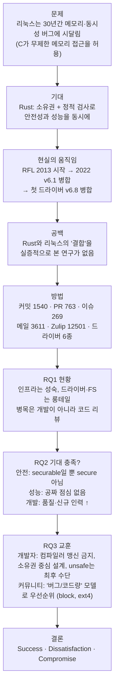

# 논문 정리 — An Empirical Study of Rust-for-Linux: The Success, Dissatisfaction, and Compromise

| 항목 | 내용 |
|---|---|
| 저자 | Hongyu Li\*, Liwei Guo\*, Yexuan Yang, Shangguang Wang, Mengwei Xu (교신) — \*공동 1저자 |
| 소속 | Beijing University of Posts and Telecommunications, University of Electronic Science and Technology of China |
| 게재 | 2024 USENIX Annual Technical Conference (ATC '24), pp. 425–443 |
| 원문 | [`논문1_Rust-for-Linux.pdf`](./논문1_Rust-for-Linux.pdf) · <https://www.usenix.org/conference/atc24/presentation/li-hongyu> |
| 데이터·도구 | <https://github.com/Richardhongyu/rfl_empirical_tools> |

> **세 줄 요약**
> 1. Rust-for-Linux(RFL)가 "C 커널의 메모리·동시성 버그를 성능 손실 없이 없앤다"는 약속을 실제로 지켰는지 처음으로 실증 분석한 논문이다.
> 2. 결론: Rust는 리눅스를 완전히 **안전(secure)** 하게 만들지는 못하고, 안전하게 만들 **수 있는(securable)** 상태로 바꾼다. `unsafe`는 피할 수 없고, 잘못 다루면 바이너리 크기·성능·개발 노력 면에서 비용이 크다.
> 3. 그래도 코드 품질(문서화 100%, CI 오류 최저)과 신규 개발자 유입 면에서는 분명한 성과가 있다. 제목의 **성공·불만·타협**이 이 세 가지 측면을 가리킨다.

---

## 목차

1. [전체 스토리라인](#1-전체-스토리라인)
2. [핵심 질문 3가지 (RQ1–RQ3)](#2-핵심-질문-3가지-rq1rq3)
3. [Why — 이 연구가 왜 필요한가](#3-why--이-연구가-왜-필요한가)
4. [How — 무엇을, 어떻게 분석했나](#4-how--무엇을-어떻게-분석했나)
5. [What — 핵심 결론](#5-what--핵심-결론)
6. [논문 전체 정리 (섹션별)](#6-논문-전체-정리-섹션별)
7. [8가지 Insight 한눈에 보기](#7-8가지-insight-한눈에-보기)
8. [핵심 수치 모음](#8-핵심-수치-모음)
9. [용어 정리](#9-용어-정리)
10. [정리자 코멘트 — 읽을 때 유의할 점](#10-정리자-코멘트--읽을-때-유의할-점)

---

## 1. 전체 스토리라인



논문의 흐름을 문장으로 풀면 다음과 같다.

1. **문제 제기.** 리눅스 커널은 오랫동안 보안을 강화해 왔지만 메모리·동시성 버그(UAF, double free, OOB, data race 등의 CVE)가 계속 나온다. 근본 원인은 C 언어다. 커널은 성능과 모듈성을 위해 무분별한 타입캐스팅과 raw pointer 역참조로 추상화 계층을 만든다.
2. **해법 후보.** Rust는 소유권(ownership)·대여(borrow)·수명(lifetime) 규칙을 **컴파일 타임**에 검사한다. 무거운 런타임 메모리 검사기나 GC가 없으므로, 안전성과 성능을 함께 가져갈 수 있다는 기대가 있다.
3. **RFL의 등장과 성장.** 2013년의 "Hello from Rust!++" 취미 프로젝트에서 시작했다. 2019년 "커널 모듈을 전부 Rust로 작성하자"는 제안, 2020년 LPC 발표, 2021년 LKML RFC를 거쳐 **2022년 Linux v6.1에 실험적 기능으로 병합**됐다. 2023년 말에는 네트워크 PHY 드라이버가 11차례 공동 리뷰 끝에 **v6.8에 첫 Rust 드라이버로 병합**됐다. 지금은 eBPF, io_uring과 견줄 만큼 활발한 서브시스템이다.
4. **연구 공백.** Rust 언어 자체는 많이 연구됐지만, Rust가 30년 된 거대 C 코드베이스에 **어떻게 녹아드는지**는 거의 연구되지 않았다.
5. **분석.** RFL의 GitHub, 메일링 리스트, Zulip 데이터를 모으고 드라이버를 실제 하드웨어에서 돌려 세 가지 질문에 답한다.
6. **답.** 인프라는 성숙했지만 리뷰가 병목이다(RQ1). 안전성은 높아졌지만 완전하지 않고, 성능은 일관되지 않으며, 코드 품질과 인력 유입은 개선됐다(RQ2). 그래서 개발자와 커뮤니티에 줄 실천 지침을 정리한다(RQ3).
7. **결론.** Rust와 커널 프로그래밍 관행 사이의 **긴장(tension)** 은 완전히 없앨 수 없다. RFL은 성공, 불만, 타협이 섞인 과정이다.

---

## 2. 핵심 질문 3가지 (RQ1–RQ3)

| RQ | 질문 | 한 줄 답 |
|---|---|---|
| **RQ1** | **RFL의 현재 상태(status quo)는 어떠한가?** | 툴체인(Kbuild 등)과 핵심 인프라(sched, mm, irq)는 성숙했다. 드라이버·파일시스템·netdev는 롱테일로 남아 있고, 진행을 막는 것은 개발 속도가 아니라 **코드 리뷰**다. Rust와 커널의 메모리 연산 방식이 맞지 않아 복잡한 우회책이 생기고, 이것이 런타임·개발 오버헤드로 이어진다. |
| **RQ2** | **RFL은 기대(hype)에 부응하는가?** (더 안전한가 / 오버헤드가 없는가 / 개발이 쉬워졌는가) | 리눅스는 **"securable"해졌을 뿐 secure하지는 않다**(`unsafe`를 피할 수 없음). 바이너리는 1.2–2.4배 커지고, 성능은 대체로 C 대비 ±20% 안이지만 설정에 따라 −61%에서 +67%까지 흔들린다. 반면 **코드 품질과 신규 개발자 유입은 크게 개선**됐다. |
| **RQ3** | **RFL에서 얻은 교훈은 무엇인가?** | 개발자에게: ① Rust 검사기를 맹신하지 말 것 ② 메모리가 아니라 **소유권 관점**으로 설계할 것 ③ `unsafe`는 **최후의 수단**으로 받아들일 것. 커뮤니티에게: **"Rust로 고칠 수 있는 버그 수 / 코드 규모"** 모델로 Rust화 우선순위를 정할 것. 79개 서브시스템 중 7개(관련 드라이버 25개)가 유망하며, linux-block과 ext4가 대표적이다. |

---

## 3. Why — 이 연구가 왜 필요한가

### 3.1 풀리지 않은 문제: 커널의 메모리·동시성 버그
- 리눅스는 슈퍼컴퓨터부터 IoT 기기까지 수십억 대의 기기에서 돌아가는 디지털 인프라의 토대다.
- 커뮤니티가 수십 년간 보안을 강화했는데도(Coverity, KMSAN, Kernel Self Protection Project 등) 메모리·동시성 버그는 계속 나온다.
- 근본 원인은 C가 메모리 객체에 **제약 없는 접근**을 허용한다는 점이다. 커널은 바로 그 자유를 이용해(wild typecasting, raw pointer 역참조) 디바이스 드라이버 같은 범용 프레임워크를 만든다.

### 3.2 Rust라는 유망한 해법, 그러나 검증되지 않은 약속
- Rust는 "런타임 오버헤드 없는 안전성"을 내세운다. 소유권 규칙을 정적으로 강제하므로 메모리 검사기나 GC가 필요 없다.
- RFL은 이 약속을 커널에 적용하려는 첫 공식 시도다. 2022년 이후 2만 줄 이상의 RFL 코드가 메인라인에 병합됐다.
- 그런데 **"정말 안전성과 성능의 딜레마를 풀었는가?"** 는 아무도 검증하지 않았다.

### 3.3 기존 연구의 한계
| 기존 연구 유형 | 한계 |
|---|---|
| 사용자 공간 Rust 프로젝트(Tock, TiKV, Redox 등)의 `unsafe` 사용·버그 분석 | 커널 맥락이 아님 |
| Rust vs C 성능 비교 | 대부분 100줄 미만의 고전 알고리즘 수준이라 실제 OS의 복잡성을 반영하지 못함 |
| Rust 전용 커널(RedLeaf, Tock, Reenix 등) | 처음부터 Rust로 짠 커널. 기존 C 코드에 Rust를 **통합하는 과정**과 레거시를 재사용하는 safe abstraction은 다루지 않음 |

### 3.4 이 연구가 주는 가치
1. **실용적 지침.** 지금 개발 중인 Rust 드라이버를 안전하고 효율적으로 구현하는 방법을 제시한다.
2. **확장 전략.** 앞으로 어떤 서브시스템을 Rust로 옮길지 정하는 근거를 준다.
3. **소프트웨어 공학적 사례.** 새 언어가 수십억 대에 배포된 거대한 레거시 코드베이스에 스며드는 과정(언어 문법·의미 적응, 새 협업 모델, 개발 도구 변화)을 기록한 드문 사례 연구다.

---

## 4. How — 무엇을, 어떻게 분석했나

### 4.1 수집한 데이터

| 출처 | 규모 |
|---|---|
| RFL GitHub | 커밋 **1,540**, PR **763**, 이슈 **269** |
| RFL 메일링 리스트 | 메일 **3,611** |
| RFL Zulip 포럼 | 토론 **12,501** |
| Rust 드라이버 | **6종** — NVMe, NULL block, e1000(NIC), Binder(Android IPC), gpio_pl061, semaphore (`unsafe` 분석에는 Apple GPU 드라이버도 포함) |
| 커뮤니티 여론 (부록 C) | 2023-08-05까지의 LWN·Hacker News(ycombinator) 게시물 |

코드는 커뮤니티 협업 방식에 따라 **세 단계**로 나눴다.

| 단계 | 정의 | 규모 |
|---|---|---|
| pending | RFL 저장소의 PR로 첫 리뷰를 기다리는 중 | 500+ 커밋 (186K LoC) |
| staged | PR을 통과해 서브시스템 메인테이너의 메일링 리스트 리뷰로 넘어감 | 1,300+ 커밋 (112K LoC) |
| merged | 업스트림(메인라인 또는 linux-next)에 공식 병합 | 160+ 커밋 (19K LoC) |

### 4.2 질문별 분석 방법

| RQ / 주제 | 분석 대상 | 방법 |
|---|---|---|
| **RQ1** 개발 현황 | 병합 코드의 서브시스템별 분포, 패치 유형(Rust 컴파일러 / Kbuild / safe abstraction), 시간에 따른 커밋·리뷰 시간 | 정규식 기반 자체 도구로 커널 자료구조·함수의 래핑 비율을 서브시스템별로 집계(LoC는 `cloc`) |
| **RQ1** Rust–커널 긴장 | safe abstraction 계층과 Rust 드라이버 코드 | bindgen 변환 규칙, helper type, 드라이버 개발 단계(probe → 기능 구현 → cleanup)를 정성 분석 |
| **RQ2-①** 안전성 | 버그 리포트(GitHub, Intel LKP, 메일링 리스트; Syzbot·KernelCI에서는 발견 없음), 드라이버의 `unsafe` 블록 | 버그를 컴파일 버그와 soundness 버그로 분류(deadlock, sleep-in-atomic도 soundness로 셈). `unsafe`는 원인별로 분류: 드라이버 로직 / safe abstraction 부재 |
| **RQ2-②** 오버헤드 | 바이너리 크기(text/data/bss/debug), 런타임 성능 | NVMe·NULL block은 `fio` 처리량, e1000·Binder는 `ping` 지연. 원인 분석에 `vtune`, `ftrace`, `pahole` 사용 |
| **RQ2-③** 개발 개선 | 문서화 커버리지, 10K LoC당 CI 오류, 개발자 경력 분포 | eBPF·io_uring(신생 서브시스템), netdev(전통 서브시스템)와 비교. 경력은 첫 커밋 시점 기준(신입 0–24개월, 숙련 24–120개월, 베테랑 120개월 초과, v6.1–v6.4 커밋) |
| **RQ3** 우선순위 모델 | 79개 서브시스템, 2,500개 이상의 드라이버 git 이력 | 수정된 버그를 수작업으로 검토해 "Rust 안전 메커니즘으로 고칠 수 있는" 메모리·스레드 안전 버그만 골라 **버그 수 / KLoC** 계산 |
| 부록 C 여론 | LWN·HN 게시물 | ChatGPT로 감성 분석과 의견 마이닝 |

### 4.3 실험 환경
- **PC:** Intel i5-4590(4코어), Q87 메인보드 + PCIe x16→M.2, DDR3 32GB, Samsung SSD 850 EVO, WD SN770(NVMe), Intel 82545 NIC
- **Raspberry Pi 4B:** Binder 실험
- NVMe, NULL block, e1000 Rust 드라이버는 C 버전 기능의 **일부만** 구현했다(Fig. 7·14에서 `*` 표시). 바이너리 크기 비교에서 "기능을 모두 구현한 드라이버"로 다룬 것은 Binder, gpio, sem이다. (본문 한 곳에는 "e1000과 toy 드라이버 2개가 기능을 모두 구현했다"고 적혀 있어 그림과 어긋난다. §10 참고)

---

## 5. What — 핵심 결론

### 5.1 한 문장 결론
> **Rust는 리눅스 커널의 취약점을 줄이지만 완전히 없애지는 못한다. 그리고 잘못 다루면 그 안전 보장의 대가로 런타임 오버헤드와 개발 노력을 크게 치른다.** (Abstract)

### 5.2 RFL 초기 목표 대비 성적표

RFL이 RFC에서 내건 목표(Table 1)를 논문 결과와 맞춰 보면 다음과 같다. 판정 기호는 정리자가 붙였다.

| 분야 | RFL의 목표 | 논문의 발견 | 판정 |
|---|---|---|---|
| Safety | 메모리·스레드 안전한 드라이버 | Rust가 안전의 "기둥" 역할을 하지만 `unsafe`가 모든 주요 드라이버에 존재. 버그 25개 발견(soundness 9개). 의미(semantic) 버그는 컴파일러가 못 잡음 | △ securable ≠ secure |
| Performance | 추상화 오버헤드 0 | 바이너리 1.2–2.4배(디버그 정보 포함 시 3.9–6.6배). 성능은 대체로 ±20%지만 −61%~+67%로 일관성이 없음 | ✗/△ 공짜 점심 없음 |
| Tools | 더 나은 문서와 CI 품질 | 문서화 100%(eBPF 15%, io_uring 31%), CI 오류 3.8건/10K LoC로 최저 | ○ 성공 |
| Efficiency | 개발 효율 향상 | drop trait로 자원 정리 자동화, 생명주기 관리 자동화. 반면 중첩 소유권 타입, 동적 배열 등 우회 구현 부담(+83% LoC), 리뷰 병목 | △ |
| Community | 더 많은 커널 개발자 | 신입 비율 58%(최고), 29명은 C 코드 기여 이력 없음. 그러나 신입은 Rust 툴체인·crate 작업에 머물고 핵심 드라이버는 기존 커널 개발자가 작성 | △ 단절 존재 |

### 5.3 제목의 세 단어로 본 결론

| | 내용 |
|---|---|
| **Success (성공)** | 메인라인 병합(v6.1) 및 첫 드라이버 병합(v6.8). 인프라(Kbuild, sched, mm, irq) 성숙. Rust가 커널 안전의 언어 수준 기둥이 됨. 문서화·테스트 품질 향상. C를 모르던 신규 개발자 유입 |
| **Dissatisfaction (불만)** | 완전한 안전은 아님(`unsafe` 불가피, 버그는 더 깊이 숨음). 바이너리 크기 증가와 성능 편차. 리뷰 병목(PR 리뷰 시간이 3년 전의 200배). 신규 인력과 기존 커널 개발자 사이의 단절. 가파른 학습 곡선 |
| **Compromise (타협)** | bitfield·union을 바이트 배열과 `transmute`로 **에뮬레이션**. `randomize_layout`, BTF tag 등 일부 속성 **무시**. inline 함수와 매크로를 non-inline Rust 함수로 **래핑**. 알려진 unsafe API(`pin-init`)를 2년 넘게 safe abstraction에 **유지**. Binder가 제네릭 대신 `unsafe` 함수 포인터를 써서 크기와 안전성을 **맞바꿈**. `unsafe`를 **최후의 수단**으로 공식 수용 |

### 5.4 실천적 메시지
- **개발자에게:** "안전은 Rust가 알아서 해 준다"는 생각을 버린다. 소유권 관계를 먼저 설계한 뒤 코딩한다. 필요하면 신중하게 검토한 `unsafe`를 쓴다. RustBelt, miri 같은 추가 분석 도구를 함께 쓴다.
- **커뮤니티에게:** 코드는 작고 Rust로 고칠 수 있는 버그가 많은 곳부터 Rust화한다(**linux-block, ext4**). 그리고 리뷰어 부족, 협업 관행 불일치, "드라이버 없이는 추상화를 리뷰 못 하고 추상화 없이는 드라이버를 못 만드는" 교착 상태를 풀어야 한다.

---

## 6. 논문 전체 정리 (섹션별)

### §1 Introduction

- **RFL 연혁 (Fig. 1)**

  | 연도 | 사건 |
  |---|---|
  | 2013 | 취미 프로젝트. 커널 헤더로 빌드한 Rust 오브젝트를 로더블 모듈에서 호출해 "Hello from Rust!++" 출력. 이때 Rust는 C 모듈이 부르는 짧은 독립 코드 조각에 불과 |
  | 2019 | "Writing Linux Kernel Modules in Safe Rust" 제안. 업스트림 커널 인터페이스에 얇은 Rust 래핑 계층을 직접 추가 |
  | 2020 | LPC(Linux Plumbers Conference) 데뷔, 첫 PR 커밋, 첫 RFL 발표 |
  | 2021 | LKML에 첫 RFL RFC ("[RFC] Rust support") |
  | 2022 | Linux **v6.1**에 실험적 기능으로 공식 병합 |
  | 2023 | 첫 RFL 드라이버(네트워크 PHY, `ax88796b`)가 RFL·netdev 커뮤니티의 11차례 공동 리뷰 끝에 승인, **v6.8**에 포함 |

- RFL은 모든 코드를 Git 저장소에서 관리하고 CI 파이프라인을 품질 게이트로 쓴다. 토론은 메일링 리스트 대신 Zulip에서 활발하게 이뤄진다.
- 네트워크, 블록 디바이스, 파일시스템, Android, GPU 등 여러 분야에서 RFL 드라이버가 시도되고 있다.
- **기여**
  1. RFL 개발 데이터셋(커밋 1,540 · 이슈 269 · PR 763 · 메일 3,611) 구축 및 공개
  2. API를 자동 처리하고 사용 통계를 서브시스템 단위로 보고하는 도구 개발
  3. RFL 개발 현황과 Rust를 커널에 통합할 때의 핵심 난제를 상세히 분석하고, 향후 드라이버 개발에 대한 조언 제시

### §2 A Primer on Rust in Linux

**Rust 안전 모델**
- **소유권과 수명:** 각 값의 소유자는 한 시점에 하나뿐이고(affine type과 유사) 소유자만 값을 수정할 수 있다. 소유자가 스코프를 벗어나면 값이 해제된다.
- **Move와 Borrow:** move는 소유권을 넘기고, borrow는 참조를 만들어 소유권을 빌려준다. 스레드 사이의 이동과 공유는 `Send`와 `Sync` trait로 표현한다.
- **`unsafe` 키워드:** 위 규칙은 이중 연결 리스트처럼 노드를 여러 곳에서 참조하는 구조를 금지할 만큼 표현력을 제한한다. 그래서 `unsafe`라는 탈출구가 있다. raw pointer 역참조, FFI 호출, 인라인 어셈블리가 허용되고, 컴파일러는 그 블록의 안전을 프로그래머에게 맡긴다. `unsafe` 코드를 safe API로 잘 감싸면 프로그램 전체가 Rust의 안전 보장을 누릴 수 있다는 것이 증명되어 있다(RustBelt).

**Rust와 리눅스를 묶는 구조 (Fig. 2)**
```
 C 헤더 (cdev.h 등)
      │  rust-bindgen (자동)
      ▼
 (a) bindings crate   ── FFI 바인딩, 전부 unsafe
      │  개발자가 수작업으로 래핑 (// SAFETY: 주석으로 전제 조건 명시)
      ▼
 (b) kernel crate     ── safe abstraction 계층
      │  safe API만 호출
      ▼
 (c) drivers crate    ── Rust 드라이버 ("zero-overhead safety"를 목표)
```
- RFL은 `// SAFETY:` 주석을 `unsafe` 블록에 대한 개발자 간 **계약**으로 쓴다. 주석에는 FFI 입력 변수의 전제 조건과 사용법을 적는다.

**RFL의 초기 목표 (Table 1):** Safety(메모리·스레드 안전 드라이버) · Performance(추상화 오버헤드 0) · Tools(더 나은 문서와 CI 품질) · Efficiency(개발 효율 향상) · Community(커널 개발자 증가)

### §3 RQ1: What is the status quo of RFL?

#### 3.1 개발 현황
> 핵심 관찰: RFL은 아직 어리지만 인프라(irq, mm, sched)는 성숙했다. 드라이버와 파일시스템은 부족해서 다음 목표가 되며, **자격 있는 리뷰어 부족이 병목**이다.

- **(1) 진행도:** 병합된 코드는 RFL 전체 코드의 **7.1%**, 커널 전체 코드의 **0.125%** 에 불과하다. 나머지 **92.9%** 는 pending 또는 staged 상태다.
  - **Insight 1 — 드라이버, netdev, 파일시스템이 RFL 코드의 롱테일이다.** 래핑된 API는 sched(함수 15.3%, 구조체 10.2%), mm, irq&clk에 몰려 있다. 반면 커널 코드의 78%(v6.2 기준)를 차지하는 drivers, file, net, security는 래핑 비율이 1% 안팎이다(평균은 함수 3.29%, 구조체 4.37%). 모든 드라이버가 쓰는 인프라를 먼저 하는 것은 합리적이지만, 드라이버는 용도가 특수해서 개발과 리뷰 비용이 크다. netdev 리뷰어들은 PHY 드라이버 하나에 6개월, 11개 버전을 썼다.
- **(2) 패치 분포**
  - **Insight 2 — RFL 인프라는 성숙했고, 다음 초점은 safe abstraction과 드라이버다.** Kbuild 패치 비중은 꾸준히 줄고, abstraction 비중은 18개월 동안 20%에서 60%로 늘었다. 2023년 4월 Rust 패치가 급증한 것은 pinned 객체를 안전하게 초기화하는 `pin-init`을 도입했기 때문이다. 그 전에는 gpio_pl061, bcm2835_rng 드라이버가 unsafe 초기화를 썼다.
- **(3) 추세 (Fig. 5)**
  - **Insight 3 — RFL의 병목은 코드 개발이 아니라 코드 리뷰다.** 병합·staged 코드는 초기 급증 후 정체됐지만 메일 교환은 계속 늘어 커뮤니티는 활발하다. 2023년 1–7월 PR의 평균 리뷰 시간은 **280시간**으로 3년 전의 **200배**다. 병합되지 않은 코드가 병합된 코드의 **13배**다. 원인은 셋이다.
    1. Rust와 커널을 모두 아는 **리뷰어 부족**
    2. RFL과 기존 서브시스템 커뮤니티의 **협업 관행 불일치**(응답 시간, 리뷰 주기)
    3. **교착 상태(deadlock):** 서브시스템 커뮤니티는 실제 드라이버 없이 abstraction 패치를 리뷰하려 하지 않고, abstraction이 없으면 드라이버를 만들 수 없다. 해결 방안이 제안되기 시작했다.
  - 긍정적 신호도 있다. NVMe, NULL block, V4L2, e1000 Rust 드라이버는 기존 리눅스 커뮤니티가 주도했다.

#### 3.2 safe abstraction으로 리눅스를 Rust화하기
핵심 과제는 타입캐스팅, 포인터 연산, 비트 연산 같은 **커널 프로그래밍 관행을 Rust 안전 규칙에 맞추는 것**이다.

**커널 자료구조 변환:** bindgen이 규칙 기반으로 기계적으로 변환한다 (Table 2).

| 종류 | C | Rust |
|---|---|---|
| 기본 타입 | `foo` | `core::ffi::c_foo` |
| 타입 포인터 | `foo *` | `*mut foo` |
| 속성 `aligned` | `aligned` | `#[repr(C)]` (주의사항 있음) |
| 속성 `unused`, `weak`, `randomize_layout` | — | 무시 |
| 함수 포인터 | `fn` | `Option<fn>` |

- **Insight 4 — 메모리를 세밀하게 제어하려는 커널의 방식이 Rust 철학과 충돌해 RFL에 오버헤드가 생긴다.**
  1. **bitfield·union 에뮬레이션:** e1000은 워드 하나에 링크 상태 플래그 4개를 저장하는 식으로 bitfield를 쓴다. Rust에는 네이티브 bitfield가 없어 **바이트 배열과 접근자**로 흉내 낸다. Rust union은 C union과 ABI가 호환되지 않아 같은 레이아웃의 `__BindgenUnionField`를 만든다. 둘 다 `transmute`를 써서 `unsafe`이고, 바이너리 크기를 늘린다.
  2. **속성 지원 불완전:** `packed`와 `aligned`는 `repr(C)`로 지원되지만 bindgen이 잘못된 코드를 만들 때가 있다. BTF tag 같은 드문 속성은 지원하지 않는다. `randomize_layout`(메모리 버그 완화용)은 무시하는데, 소유권과 경계 검사가 같은 역할을 하므로 합리적이다.
- **Insight 5 — RFL은 helper type으로 커널 데이터의 "관리"는 Rust에 맡기고 "연산"은 커널에 남긴다.** 바인딩에는 raw pointer(`*mut`)가 많아 드라이버에 그대로 노출할 수 없다.
  1. **Type + Deref coercion:** 커널 포인터 역참조와 캐스팅을 제한한다. 예를 들어 device 구조체의 `void *` 디바이스 데이터는 `Deref` 구현이 올바른 타입으로 역참조되도록 강제한다.
  2. **생명주기 관리 자동화:** 저수준 타입 `ScopeGuard`, `ARef`, `Opaque`를 도입했다. `ScopeGuard`는 스코프 종료 시 drop으로 자원을 해제하고, `ARef`는 참조와 해제 시 refcount를 자동으로 올리고 내린다. 개발자가 직접 부르던 `get/put_task_struct`가 필요 없어지고, 문서화되지 않았던 커널 관행이 코드로 굳어진다.
  - 예: mutex/spinlock 백엔드를 다시 작성했다. 관리(보호 데이터 역참조, 자원 회수)는 Deref와 ScopeGuard가 맡고, 연산(lock/unlock)은 여전히 커널 함수를 호출한다.

**커널 함수 통합** (trait를 적극 활용)
1. **함수를 구조체 멤버로:** `queue_work_on` 같은 workqueue 함수를 `workqueue_struct`의 helper type인 `Queue`의 메서드로 묶었다(OOP 스타일). 가독성이 좋아지고 호출자가 null이 아님이 보장되어 포인터 유효성 검사가 필요 없다.
2. **함수 포인터를 trait로:** 콜백을 helper type의 trait로 만들고 trait bound로 타입을 제한한다. 잘못된 타입캐스팅에서 오는 취약점(CVE-2018-5861 류)을 막는다.
3. **inline 함수와 매크로 래핑:** `static inline` 함수는 non-inline Rust 함수로 감싼다. 현재 Rust에는 C 함수 FFI를 편하게 inline하는 수단이 없다. 함수형 매크로는 Rust 매크로로 다시 쓰지 않고 helper 함수로 감싼다. 불안정한 커널 인터페이스를 두 벌 유지하지 않으려는 선택이다.

#### 3.3 디바이스 드라이버를 Rust화하기
C에서 하던 "데이터 레이아웃 추론"이 Rust에서는 "데이터 **소유권** 추론"으로 바뀐다.

1. **디바이스 probing:** 디바이스 데이터에 소유권 타입을 붙여야 한다. 스레드끼리 공유하면 `Arc`, C 쪽과 공유하려고 이동을 막으려면 `Pin`을 쓴다. 이 타입들이 중첩되면 이해하기 어렵다. 예: e1000의 rx ring 타입은 `Pin<Box<SpinLock<Box<Ring<RxDesc>>>>>`이고, 각 계층이 자기 초기화 함수(`Pin::from`, `Box::try_new` 등)를 따로 호출해야 한다.
2. **드라이버 기능 구현** (`ndo_open`, `ndo_start_xmit` 등): C와 비슷하지만 두 가지 어려움이 있다.
   - **동적 크기 배열이 어렵다.** C는 포인터와 `len` 필드로 해결한다. Rust에서는 `dyn_num` trait와 const generic 등 여러 계층을 추가해야 해서 같은 기능에 **코드가 83% 늘어난다**(RROS 사례, 부록 A).
   - **커널 실행 문맥은 여전히 개발자 책임이다.** Rust는 atomic인지 sleepable인지 같은 실행 문맥을 컴파일 타임에도 런타임에도 검사하지 않는다.
3. **디바이스 정리(cleanup):** C 드라이버는 `goto`로 중앙 정리 루틴에 모인다. Rust는 safe abstraction이 구현한 drop trait로 오류가 나거나 수명이 끝날 때 **자동으로 자원을 회수**한다.

- **Insight 6 — Rust로 안전한 드라이버를 쓰는 가장 큰 어려움은 Rust의 경직성과 커널 프로그래밍 관행을 조화시키는 일이다. 저자들이 보기에 RFL과 리눅스 커뮤니티는 이 문제를 자주 간과한다.**

### §4 RQ2: Does RFL live up to the hype?

#### 4.1 RFL은 리눅스를 "securable"하게 만든다
- **방법:** RFL의 안전은 드라이버와 safe abstraction에서 `unsafe`를 얼마나 없앴는지에 달려 있다. 그래서 버그 리포트와 `unsafe` 사용을 취약점의 진입점으로 보고 조사했다.
- **버그 결과 (Table 4):** 총 **25개**(메인라인 15, staged rust 브랜치 10).

  | 출처 | 컴파일 버그 (병합/staged) | Soundness 버그 (병합/staged) |
  |---|---|---|
  | GitHub | 4 (1/3) | 7 (3/4) |
  | Intel LKP | 8 (6/2) | 0 |
  | 메일링 리스트 | 4 (4/0) | 2 (1/1) |
  | **합계** | **16** | **9** |

  - 컴파일 버그는 커널 설정 오류, Clang 툴체인 버전 비호환, Kbuild와 rustc의 불일치 때문이며 안전 취약점은 아니다.
  - Soundness 버그 9개 중 **6개는 safe abstraction 계층에서 메모리 안전**을, **3개는 스레드 안전**을 깨뜨린다. 병합된 코드의 soundness 버그 4개는 모두 safe abstraction 관련이다.
  - Syzbot과 KernelCI에서는 버그가 발견되지 않았다.
- **`unsafe` 사용 (Table 3):** 메인라인 드라이버에는 `unsafe`가 없다. 병합된 드라이버가 130줄짜리 하나뿐이기 때문이다. 메일링 리스트에 제안된 드라이버를 보면 다음과 같다.

  | 드라이버 | 드라이버 로직이 너무 복잡해서 | safe abstraction이 없어서 |
  |---|---|---|
  | GPU (Apple) | 107 | 7 |
  | NVMe | 44 | 16 |
  | Binder | 45 | 9 |
  | E1000 | 4 | 2 |
  | Semaphore | 0 | 4 |
  | Gpio_pl061 | 0 | 3 |
  | Null block | 0 | 0 |

- **Insight 7 — RFL로 리눅스는 더 "securable"해졌지만 완전히 secure하지는 않다.** (Multics 보안 감사의 결론을 떠올리게 하는 판정)
  1. **Rust의 안전 메커니즘은 커널 안전의 기둥이다.** 언어 수준 지원이 기존 버그를 고치고 잠재적 메모리·동시성 버그를 피하게 해 준다. 풍부한 타입 정보 덕분에 klint, RustBelt 같은 검사기를 쓸 수 있다. 공격 표면이 크게 줄어 개발자가 추론해야 할 범위도 줄어든다.
  2. **`unsafe`는 불가피하지만, 취약점까지 불가피한 것은 아니다.** 모든 주요 드라이버에 `unsafe`가 있다. 이유는 두 가지다.
     - 커널은 메모리와 하드웨어를 완전히 통제해야 한다. TLB 관리와 메모리 배리어용 인라인 어셈블리, MMIO 레지스터 역참조용 raw pointer, union/bitfield는 소유권 메커니즘(affine type 시스템)의 범위 밖이다.
     - 커뮤니티가 **타협**할 때가 있다. 소유권 때문에 구현이 꼬이면 리뷰가 길어지고, 그동안 unsafe라도 쓸 수 있는 API가 필요하다. 예: `pin-init`은 Rust 검사기 기준으로 unsafe로 알려졌지만 **2년 넘게 safe abstraction 계층에 남아 있다가** 여러 차례 논쟁 끝에 최근에야 수정됐다.
  3. **버그는 사라지지 않고 더 깊이 숨는다.** safe abstraction이 호출하는 C 커널 함수에는 여전히 버그가 있을 수 있다. Rust 검사기는 **의미(semantic) 버그**를 잡지 못한다. 이런 버그는 Rust와 커널의 메모리 할당 방식 차이에서 생기고, 두 분야를 모두 아는 전문가만 찾을 수 있다. 예: C Binder의 use-after-free 버그는 Rust로 다시 쓰자 같은 증상 대신 **메모리를 엉뚱한 곳에 매핑하는 버그**로 나타났고, 이 버그는 Rust 컴파일러 검사를 모두 통과했다.

#### 4.2 Rust는 오버헤드를 가져오는가?
- **바이너리 크기 (Fig. 7):** 기능을 모두 구현한 Rust 드라이버가 C보다 크다. **Binder 1.2배, gpio 2.4배, sem 1.9배.**
  - 증가분 대부분이 text 섹션이다. 그중 **99%는 C에 없는 Rust 기능**(제네릭, 경계 검사, 생명주기 관리)을 위한 코드다. 커널 함수를 호출만 하는 래퍼도 크기가 33% 늘어난다.
  - Binder의 증가 폭이 작은 이유는 제네릭 대신 `unsafe` 함수 포인터를 많이 썼기 때문이다. 크기를 얻고 RFL이 의도한 안전을 내준 셈이다.
- **성능 (Fig. 8–10):** 대체로 C와 **20% 안쪽** 차이다. 가끔은 크게 뒤지고, 드물게 앞선다.
  - **e1000:** ping 지연이 **11배** 느리다. Rust 드라이버에 prefetch 같은 고급 기능이 없어서다.
  - **Binder:** C와 비슷하고 지연 차이는 약 10%다.
  - **NVMe·NULL block:** 설정(job 수, block size, iodepth, 스케줄러)에 따라 처리량이 **최대 61% 낮거나 최대 67% 높다**. Rust는 job 수와 block size가 작을 때 유리한데, Rust 구조체가 더 작아 캐시 라인에 잘 들어가기 때문으로 보인다.
- **같은 기능, 같은 코드 경로에서도 차이가 나는 이유** (vtune, ftrace로 분석)

  | Rust가 느린 이유 | Rust가 빠른 이유 |
  |---|---|
  | lock의 granularity가 거칠다. Rust가 스레드 안전을 보장해도 고성능 동시성 프로그래밍은 여전히 개발자 몫이다 | 내부에 아이템 메모리를 두지 않고 스마트 포인터를 써서 구조체가 작다(`pahole` 확인 결과 캐시 라인을 덜 씀) |
  | 배열 경계 검사 등 런타임 검사(선행 연구는 최대 2.49배 오버헤드 보고). 메모리 집약적 작업에 불리 | C의 기능을 다 구현하지 않아 일부 코드 경로가 생략됨 |
  | bitfield 에뮬레이션(배열 접근 + 경계 검사) | |
  | 소유권 공유를 위해 포인터를 많이 써서 cache/TLB/branch miss가 많음(특히 icache miss) | |

- **Insight 8 — 성능에 공짜 점심은 없다. 결국 프로그래머가 중요하다.**

#### 4.3 Rust는 리눅스 개발을 어떻게 개선하는가?
- **코드 품질과 가독성 향상 (Table 6)**

  | 서브시스템 | 문서화 커버리지 | CI 오류 / 10K LoC |
  |---|---|---|
  | **RFL** | **100%** | **3.8** |
  | eBPF | 15% | 7.5 |
  | io_uring | 31% | 11.9 |

  CI 오류는 eBPF보다 49%, io_uring보다 68% 적다. 이유는 두 가지다.
  1. **rustdoc lint**로 문서를 코드와 묶고 필수로 만들 수 있다. 기존 커널은 암묵적 합의나 수동 리뷰에 의존해서 문서가 자주 빠진다. 예: io_uring의 `io_uring_cmd_complete_in_task`는 문서가 없어 `io_uring_cmd_done`과 혼동되고, 이 혼동이 deadlock 버그로 이어졌다. 커뮤니티는 "문서 부족이 리눅스의 1번 버그"라고 말한다.
  2. **내장 테스트(`#[cfg(test)]`)** 를 PR마다 GitHub CI에서 자동으로 돌린다. 기존 커널의 KUnit과 Intel LKP는 코드가 staged되거나 병합된 **후에야** 테스트한다.
- **새로운 인력 유입 (Fig. 11):** 신입(경력 24개월 이하) 비율이 **RFL 58%** 로, eBPF(39%)보다 19%p, io_uring(38%)보다 20%p, netdev(29%)보다 29%p 높다. 이 중 **29명은 C 코드를 한 줄도 기여한 적이 없다.** Rust가 이들을 커널로 끌어들인 주요 요인으로 보인다.
- **그러나 아직 핵심 개발자나 메인테이너는 아니다.** 신입의 커밋은 주로 Rust 툴체인과 crate 작업이고 커널 코드 개발에는 참여하지 않는다. 조사한 드라이버 6개 중 5개는 기존 리눅스 커뮤니티 개발자가 주로 작성했다. 신입과 베테랑 사이에 **단절**이 있고, Rust가 커널 프로그래밍의 **진입 장벽을 낮추지는 못했다**.

### §5 RQ3: What are the experiences and lessons?

**개발자에게 (RFL을 만들고 쓰는 사람)**
1. Rust 내장 검사기를 **성배로 여기지 말고** RustBelt, miri 같은 종합 분석 도구를 함께 쓴다. 실제 드라이버에서 의미 버그를 놓치는 것을 확인했다(§4.1).
2. safe abstraction과 드라이버 자원을 메모리가 아니라 **소유권 관점**으로 설계한다. 코딩 전에 구조체 간 소유권 관계를 분명히 정한다. 스마트 포인터를 잘못 고르면 나중에 고치는 비용이 매우 크다.
3. **`unsafe`를 최후의 수단으로 받아들인다.** 커널 메모리 연산을 Rust 규칙에 억지로 맞추면 스마트 포인터와 제네릭이 대량으로 들어가 메모리 사용량과 오버헤드가 커진다(§4.2). 안전성을 꼼꼼히 검토했다면 `unsafe` 구현을 택해도 된다.

**커뮤니티에게 (RFL 적용 범위 확장)**
- **이익 모델:** 서브시스템/드라이버별로 `누적된 Rust 수정 가능 버그 수 / 코드 규모(KLoC)`를 계산한다. 작고 메모리·스레드 버그가 많을수록 Rust화 가치가 높다. 커뮤니티의 드라이버 선정 기준과도 맞는다.
- **분석 (Fig. 12):** 79개 서브시스템, 2,500개 이상의 드라이버를 분석했다. 평균은 **1.3 bugs/KLoC**이고 서브시스템마다 편차가 크다.
  - **linux-block:** 수정 438건 중 **data race 113건, dangling pointer 98건**으로 가장 높다. 커뮤니티도 이미 NULL block 드라이버를 RFL로 다시 썼다(§4.2에서 테스트한 그 드라이버).
  - **linux-ext4:** 역시 가치가 높다. VFS safe abstraction이 제안됐고 Rust 파일시스템(PuzzleFS, tarfs)도 나오고 있어, RFL의 다음 단계로 예상된다.
  - 종합하면 **79개 중 7개 서브시스템과 관련 드라이버 25개**가 Rust화 이익이 크다.

### §6 Related Works
| 분야 | 기존 연구 | 이 논문과의 차이 |
|---|---|---|
| 실제 Rust 사용 연구 | Tock, TiKV, Redox 등의 `unsafe` 사용 이유, 사용자 프로그램과 컴파일러 버그 | Rust와 **리눅스 커널 코드베이스의 통합**을 다루고, RFL이 원래 목표를 달성했는지 평가 |
| Rust 오버헤드 | 같은 프로그램을 C와 Rust로 구현해 비교(대부분 100줄 미만), UDP 터널링 드라이버 | **실제 리눅스 드라이버**의 런타임 지표와 오브젝트 크기를 종합 측정 |
| Rust 기반 커널 | 임베디드·PC용 Rust 전용 커널(Tock, RedLeaf, Reenix, unikernel 등) | 기존 C 소프트웨어에 Rust를 **통합하는 과정**과 레거시 재사용용 safe abstraction을 다룸 |
| Rust 강화 | 학습 곡선 연구, `unsafe` 안전성 강화(형식 검증, 정적 분석, 샌드박스: RustBelt, Rudra, MirChecker, TRust, PKRU-Safe, Sandcrust, XRust, Galeed 등) | Rust와 리눅스를 더 잘 통합하기 위한 통찰 제공 |

### §7 Conclusions
- Rust로 리눅스를 강화하려는 첫 프로젝트인 RFL을 철저히 조사했다.
- safe abstraction 계층과 Rust 드라이버를 분석해 **Rust 언어 기능과 커널 프로그래밍 사이의 긴장**을 드러냈다.
- RFL은 안전성을 높이지만 **컴파일러가 잡지 못하는 더 은밀한 누수**가 남아 있다. Rust와 리눅스 사이의 긴장에서 오는 **오버헤드는 완전히 없앨 수 없다**.
- 이 교훈들이 RFL의 향후 개발에 길잡이가 되기를 기대한다.

### 부록
- **A. 커널 공간에서 Rust의 경직성 사례 (Fig. 13):** 문자 디바이스의 동적 배열을 구현하는 예다. C는 포인터로 `len`만 바꾸면 인스턴스마다 크기를 다르게 할 수 있다(thread factory 256, proxy factory 8). Rust에서는 const generic `N`이 한 번 정해지면 모든 인스턴스가 같은 크기(256 또는 8)를 써야 해서 메모리에 구멍이나 단편화가 생긴다. 우회하려면 `dyn_num` trait를 정의하고, 인스턴스별 const generic 타입을 만들고, 각 타입에 trait를 구현해야 한다. 그만큼 개발 부담과 런타임 검사가 늘어난다.
- **B. 디버그 정보 포함 시 오버헤드 (Fig. 14):** 디버그 정보를 남기면 Rust 드라이버가 C보다 **3.9–6.6배** 크다. 기능을 일부만 구현한 드라이버도 마찬가지다. 제네릭 때문에 심볼이 많고 이름이 길어서다. 플래시와 메모리가 MB 단위인 임베디드 기기에서는 무시할 수 없다.
- **C. 커널 커뮤니티의 시각 (Fig. 15):** LWN과 HN 게시물을 ChatGPT로 분석했다.

  | | Hacker News | LWN | 합계 |
  |---|---|---|---|
  | 긍정 | 31.7% | 8.6% | **40.3%** |
  | 부정 | 46.3% | 13.5% | **59.8%** |

  - 긍정 이유 Top 5: 안전성·메모리 안전 / 호환성·통합 / 성능·효율 / 코드 품질·표준 / 표현력·기능
  - 부정 이유 Top 5: 학습 곡선·복잡성 / 커널 호환성 / 자원 할당 / 개발자 정서 / 과도한 홍보(hype)
  - 해석: Rust는 보안과 성능 때문에 인기가 있지만 가파른 학습 곡선이 가장 큰 걱정거리다. 커널 안에서 스스로를 증명하려면 시간이 더 필요하다.

---

## 7. 8가지 Insight 한눈에 보기

| # | 위치 | Insight |
|---|---|---|
| 1 | §3.1 진행도 | 드라이버, netdev, 파일시스템이 RFL 코드의 **롱테일**이다 |
| 2 | §3.1 패치 분포 | RFL **인프라는 성숙**했고 다음 초점은 safe abstraction과 드라이버다 |
| 3 | §3.1 추세 | RFL의 병목은 코드 개발이 아니라 **코드 리뷰**다 |
| 4 | §3.2 자료구조 | 메모리를 세밀하게 제어하려는 커널의 방식이 Rust 철학과 **충돌**해 오버헤드가 생긴다 |
| 5 | §3.2 helper type | helper type으로 커널 데이터의 **관리는 Rust에, 연산은 커널에** 맡긴다 |
| 6 | §3.3 드라이버 | 가장 큰 어려움은 Rust의 **경직성**과 커널 관행의 조화이며, 자주 간과된다 |
| 7 | §4.1 안전 | 리눅스는 더 **"securable"** 해졌지만 완전히 secure하지는 않다 |
| 8 | §4.2 성능 | 성능에 **공짜 점심은 없다**. 결국 프로그래머가 중요하다 |

---

## 8. 핵심 수치 모음

| 지표 | 값 |
|---|---|
| 병합된 RFL 코드 / 전체 커널 코드 | **0.125%** |
| 병합 : 미병합(pending + staged) RFL 코드 | 7.1% : 92.9% (미병합이 13배) |
| PR 평균 리뷰 시간 (2023년 1–7월) | **280시간** (3년 전의 200배) |
| abstraction 패치 비중 변화 | 18개월 동안 20% → 60% |
| 발견된 RFL 버그 | **25개** (컴파일 16, soundness 9: 메모리 안전 6 + 스레드 안전 3) |
| `unsafe` 최다 드라이버 | GPU 114회 (로직 107 + abstraction 부재 7) |
| 동적 배열 구현 시 코드 증가 | +83% LoC |
| 바이너리 크기 (기능 동일 드라이버) | Binder 1.2배, sem 1.9배, gpio 2.4배 |
| 디버그 정보 포함 바이너리 크기 | C 대비 3.9–6.6배 |
| 래퍼 함수 크기 증가 | +33% |
| 일반적인 성능 차이 | C 대비 ±20% 이내 |
| 처리량 편차 (NVMe/NULL block) | −61% ~ +67% |
| e1000 ping 지연 | C 대비 11배 느림 (prefetch 등 미구현) |
| 문서화 커버리지 | RFL 100% vs eBPF 15% vs io_uring 31% |
| CI 오류 / 10K LoC | RFL 3.8 vs eBPF 7.5 vs io_uring 11.9 |
| 신입 개발자 비율 | RFL 58% vs eBPF 39% vs io_uring 38% vs netdev 29% |
| C 기여 이력 없는 RFL 개발자 | 29명 |
| 서브시스템 평균 Rust 수정 가능 버그 밀도 | 1.3 bugs/KLoC |
| linux-block 수정 438건 중 | data race 113 + dangling pointer 98 |
| Rust화 우선 후보 | 79개 중 7개 서브시스템, 관련 드라이버 25개 (linux-block, ext4 등) |
| 커뮤니티 여론 (LWN + HN) | 긍정 40.3% / 부정 59.8% |

---

## 9. 용어 정리

| 용어 | 설명 |
|---|---|
| **RFL (Rust-for-Linux)** | 리눅스 커널에서 Rust로 드라이버와 모듈을 작성할 수 있게 하는 프로젝트 |
| **Ownership / Borrow / Lifetime** | Rust 안전 모델의 세 축. 값의 소유자는 하나, 참조로 빌려줄 수 있음, 스코프가 끝나면 자동 해제 |
| **`Send` / `Sync`** | 스레드 간 소유권 이동(`Send`)과 참조 공유(`Sync`)가 안전함을 나타내는 trait |
| **`unsafe`** | 컴파일러의 소유권 검사를 우회하는 블록. raw pointer 역참조, FFI, 인라인 어셈블리 허용 |
| **FFI** | Foreign Function Interface. Rust에서 C 함수를 호출하는 경로 |
| **rust-bindgen** | C 헤더에서 Rust FFI 바인딩을 자동 생성하는 도구 |
| **crate** | Rust의 라이브러리/패키지 단위. RFL은 bindings, kernel, drivers crate로 나뉨 |
| **Safe abstraction** | unsafe한 FFI 바인딩을 safe API로 감싼 계층(kernel crate). 드라이버는 이 계층만 호출해야 함 |
| **Helper type** | 커널 구조체를 감싸 Rust식 관리(Deref, drop 등)를 붙인 타입 (예: workqueue의 `Queue`) |
| **Deref coercion** | `Deref` trait 구현으로 역참조 결과 타입을 강제하는 Rust 기능 |
| **`ScopeGuard` / `ARef` / `Opaque`** | RFL 저수준 타입. 각각 스코프 종료 시 정리, refcount 자동 관리, C 구조체 불투명 래핑 |
| **`Arc` / `Box` / `Pin`** | 원자적 참조 카운트 공유 포인터 / 힙 소유 포인터 / 메모리 이동 금지 래퍼 |
| **`pin-init`** | pinned 객체를 안전하게 초기화하는 RFL API. 2년 넘게 unsafe 문제가 있다가 수정됨 |
| **`transmute`** | 메모리를 다른 타입으로 재해석하는 unsafe 연산 |
| **Soundness bug** | safe 코드만으로 정의되지 않은 동작(메모리·스레드 안전 위반)을 일으킬 수 있는 버그 |
| **Semantic bug** | 타입과 소유권 규칙은 지키지만 로직이 틀린 버그. 컴파일러가 못 잡음 |
| **Kbuild** | 리눅스 커널 빌드 시스템 |
| **pending / staged / merged** | RFL 코드 단계: RFL PR 대기 / 서브시스템 메일링 리스트 리뷰 중 / 업스트림 병합 |
| **Intel LKP, Syzbot, KernelCI, KUnit** | 커널 성능·회귀 테스트, 퍼저, 분산 테스트 자동화, 단위 테스트 프레임워크 |
| **LPC / LKML / Zulip** | Linux Plumbers Conference / Linux Kernel Mailing List / RFL이 쓰는 채팅형 포럼 |
| **icache miss** | 명령어 캐시 미스. 제네릭과 코드 크기 증가가 늘림 |

---

## 10. 정리자 코멘트 — 읽을 때 유의할 점

> 아래는 논문 본문이 아니라 정리자의 해석이다.

- **성능 비교의 공정성:** NVMe, NULL block, e1000 Rust 드라이버는 C 버전 기능의 일부만 구현했다. e1000이 11배 느린 것이나 일부 설정에서 Rust가 더 빠른 것은 언어보다 **기능 차이**의 영향이 클 수 있다. 저자들도 이 점을 밝히고 있다.
- **표본 규모:** 버그 25개, 드라이버 6–7종, 메인라인 병합 드라이버 1개(약 130줄)라는 작은 표본으로 "unsafe는 불가피하다", "securable하지만 secure하지 않다" 같은 일반화를 하고 있다. 결론의 방향은 설득력이 있지만 수치는 RFL 초기 단계의 스냅샷으로 읽어야 한다.
- **측정 도구의 한계:** API 래핑 비율은 정규식 기반 도구로 셌고, 커뮤니티 여론은 ChatGPT로 분류했다. 정밀도 검증이 따로 제시되지 않았으므로 경향을 보는 정도로만 쓰는 편이 안전하다.
- **수치 불일치:** 본문은 RFL 신입 비율을 58%로 적었지만 Fig. 11 막대에는 61로 표시된다. 서론에서는 "5개 드라이버를 실제 하드웨어에서 실행"했다고 했지만 Table 5에서 벤치마크가 정의된 드라이버는 4개다. §4.2 본문은 "e1000과 toy 드라이버 2개만 C의 기능을 모두 구현했다"고 적었지만, 그림은 e1000에 '일부 구현' 표시를 붙이고 바이너리 비교는 Binder를 완전 구현 드라이버로 다룬다. 이 정리는 수치는 본문을, 기능 구현 여부는 그림을 따랐다.
- **시점:** 데이터는 2023년 말에서 2024년 초 기준이다. 이후 RFL은 계속 바뀌고 있으므로 최신 현황(병합 드라이버, 리뷰 정책, 커뮤니티 논의)은 따로 확인해야 한다.
- **C → Rust 전환 관점의 시사점:** 이 저장소(CtoRust)의 주제와 연결하면, 이 논문은 **"C 코드를 Rust로 옮기면 자동으로 안전해진다"는 가정을 반박하는 근거**로 쓸 수 있다. 전환의 실제 비용은 ① 데이터 레이아웃 중심 설계를 소유권 중심 설계로 바꾸는 일 ② 언어 사이 경계(FFI, safe abstraction)에 남는 `unsafe` ③ 리뷰·검증 인력에 있다.
